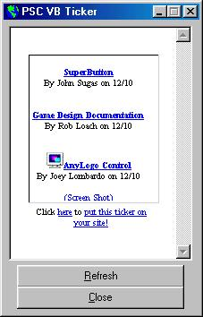



## PSC VB Ticker

### Description

Little Prog that puts the VB ticker on the PSC website in a window. I didn't like having it on my active tesktop, since i only have a stinkin' 56k. This you can minimize. Just like a web-browser, but only the html for the ticker. Vote/Comment if u want. C-ya. Oh, i used this in 800 x 600 High Color screen.
 
### More Info
 

             |
---                |---
**Submitted On**   |2002-12-09 19:49:52
**By**             |[Robert Altman](https://github.com/Planet-Source-Code/PSCIndex/blob/master/ByAuthor/robert-altman.md)
**Level**          |Beginner
**User Rating**    |4.0 (8 globes from 2 users)
**Compatibility**  |VB 5\.0, VB 6\.0
**Category**       |[Internet/ HTML](https://github.com/Planet-Source-Code/PSCIndex/blob/master/ByCategory/internet-html__1-34.md)
**World**          |[Visual Basic](https://github.com/Planet-Source-Code/PSCIndex/blob/master/ByWorld/visual-basic.md)
**Archive File**   |[PSC\_VB\_Tic15112712102002\.zip](https://github.com/Planet-Source-Code/robert-altman-psc-vb-ticker__1-41491/archive/master.zip)

